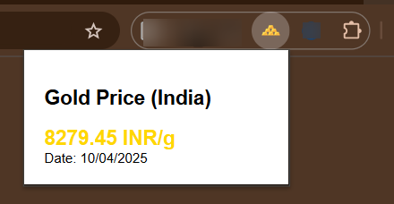

# goldie-bo

# 🧪 Chrome Extension: Daily Gold Prices in INR 🇮🇳

This is a beginner-friendly Chrome Extension that fetches and displays **real-time gold prices** in Indian Rupees (INR), built using **HTML, JavaScript**, and help from **Grok AI**.

> ✨ Built by a non-coder, powered by AI.

---

## 📸 Screenshot

---

## 🧰 Tech Stack

- HTML & JavaScript
- Chrome Extension API
- [GoldAPI.io](https://www.goldapi.io) or [MetalPriceAPI.com](https://www.metalpriceapi.com)

---

## 🚀 Features

- 💰 Displays current gold price in INR
- 🌐 Uses live API data
- 🧠 100% AI-assisted development (thanks, Grok!)
- 🛠️ Clean and minimal UI

---

## 📦 How to Install

1. Download this repo (or clone it).
2. Go to `chrome://extensions` in your browser.
3. Enable **Developer Mode** (top right).
4. Click **Load Unpacked**.
5. Select the project folder.
6. Click the extension icon and boom 💥 — see the gold price!

---

## ⚠️ Important

- Don’t forget to **add your own API key** in `popup.js`.
- Avoid committing any API keys — use `.gitignore` to protect sensitive info.

---

## 🤖 Built With Help From

- 🧠 [Grok AI](https://x.ai)
- ❤️ A whole lot of curiosity and trial & error

---

## 📄 License

MIT — feel free to use, learn, and modify!

---

Let me know if you want a `LICENSE` file or want this uploaded to your GitHub repo directly!
